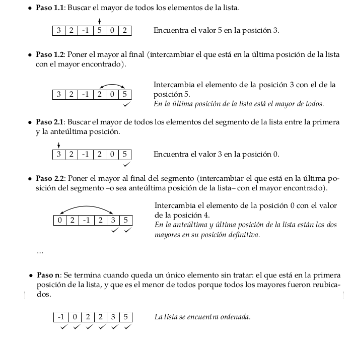
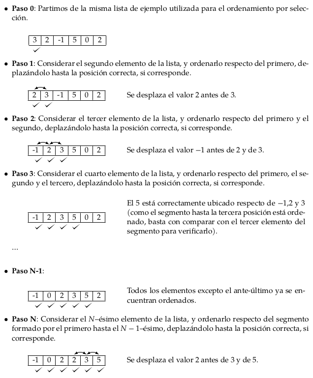

[Contenidos](../Contenidos.md) \| [Próximo (2 Ordenamiento mergesort)](02_Divide_and_Conquer.md)

# 12.1 Ordenamientos sencillos de listas


El problema del ordenamiento es tan fundamental que, a pesar que Python ya lo hace con su método `sort()` por ejemplo, nos interesa discutirlo. Vamos a empezar viendo las más sencillas de escribir
(que en general suelen ser las más caras).

## Ordenamiento por selección
El método de *ordenamiento por selección* se basa en la siguiente idea:



La implementación en Python puede verse en el siguiente código.

```python
def ord_seleccion(lista):
    """Ordena una lista de elementos según el método de selección.
       Pre: los elementos de la lista deben ser comparables.
       Post: la lista está ordenada."""

    # posición final del segmento a tratar
    n = len(lista) - 1

    # mientras haya al menos 2 elementos para ordenar
    while n > 0:
        # posición del mayor valor del segmento
        p = buscar_max(lista, 0, n)

        # intercambiar el valor que está en p con el valor que
        # está en la última posición del segmento
        lista[p], lista[n] = lista[n], lista[p]
        print("DEBUG: ", p, n, lista)

        # reducir el segmento en 1
        n = n - 1

def buscar_max(lista, a, b):
    """Devuelve la posición del máximo elemento en un segmento de
       lista de elementos comparables.
       La lista no debe ser vacía.
       a y b son las posiciones inicial y final del segmento"""

    pos_max = a
    for i in range(a + 1, b + 1):
        if lista[i] > lista[pos_max]:
            pos_max = i
    return pos_max
```

La función principal, `ord_seleccion()` es la encargada de recorrer
la lista, ubicando el mayor elemento al final del segmento y luego
reduciendo el segmento a analizar.

La función `buscar_max()` busca el mayor elemento de un segmento de
la lista y devuelve su posición.

A continuación, algunas una ejecuciones de prueba de ese código:

```python
>>> l = [3, 2, -1, 5, 0, 2]
>>> ord_seleccion(l)
DEBUG:  3 5 [3, 2, -1, 2, 0, 5]
DEBUG:  0 4 [0, 2, -1, 2, 3, 5]
DEBUG:  1 3 [0, 2, -1, 2, 3, 5]
DEBUG:  1 2 [0, -1, 2, 2, 3, 5]
DEBUG:  0 1 [-1, 0, 2, 2, 3, 5]
>>> l
[-1, 0, 2, 2, 3, 5]
>>> l = []
>>> ord_seleccion(l)
>>> l = [1]
>>> ord_seleccion(l)
>>> l
[1]
>>> l = [1, 2, 3, 4, 5]
>>> ord_seleccion(l)
DEBUG:  4 4 [1, 2, 3, 4, 5]
DEBUG:  3 3 [1, 2, 3, 4, 5]
DEBUG:  2 2 [1, 2, 3, 4, 5]
DEBUG:  1 1 [1, 2, 3, 4, 5]
```


Puede verse que aun cuando la lista está ordenada, se la recorre buscando
los mayores elementos y ubicándolos en la misma posición en la que se
encuentran.

### Invariante en el ordenamiento por selección

Todo ordenamiento tiene un invariante que permite asegurarse de que cada
paso que se toma va en la dirección de obtener una lista ordenada.

En el caso del ordenamiento por selección, el invariante es que los
elementos desde `n + 1` hasta el final de la lista están ordenados y
son mayores que los elementos de `0` a `n`; es decir
que ya están en su posición definitiva.

### ¿Cuánto cuesta ordenar por selección?

Como se puede ver en el código de la función `buscar_max`, para
buscar el máximo elemento en un segmento de lista se debe recorrer todo ese
segmento, por lo que en nuestro caso debemos recorrer en el primer paso `N`
elementos, en el segundo paso `N-1` elementos, en el tercer paso `N-2`
elementos, etc. Cada visita a un elemento implica una cantidad constante y
pequeña de comparaciones (que no depende de `N`). Por lo tanto tenemos que

`T(N) ~  c * (2 + 3 + ... + N) ~ c * N * (N+1)/2 ~ N^2`

O sea que ordenar por selección una lista de tamaño `N` insume tiempo del
orden de `N^2`.  Como ya se vio, este tiempo es independiente de si la
lista estaba previamente ordenda o no.

En cuanto al espacio utilizado, sólo se tiene en memoria la
lista que se desea ordenar y algunas variables de tamaño 1.

## Ordenamiento por inserción

El método de *ordenamiento por inserción* se basa en la siguiente idea:



Una posible implementación en Python de este algoritmo se incluye en el
Código~\ref{ord_insercion*.

```python
def ord_insercion(lista):
    """Ordena una lista de elementos según el método de inserción.
       Pre: los elementos de la lista deben ser comparables.
       Post: la lista está ordenada."""

    for i in range(len(lista) - 1):
        # Si el elemento de la posición i+1 está desordenado respecto
        # al de la posición i, reubicarlo dentro del segmento [0:i]
        if lista[i + 1] < lista[i]:
            reubicar(lista, i + 1)
        print("DEBUG: ", lista)

def reubicar(lista, p):
    """Reubica al elemento que está en la posición p de la lista
       dentro del segmento [0:p-1].
       Pre: p tiene que ser una posicion válida de lista."""

    v = lista[p]

    # Recorrer el segmento [0:p-1] de derecha a izquierda hasta
    # encontrar la posición j tal que lista[j-1] <= v < lista[j].
    j = p
    while j > 0 and v < lista[j - 1]:
        # Desplazar los elementos hacia la derecha, dejando lugar
        # para insertar el elemento v donde corresponda.
        lista[j] = lista[j - 1]
        j -= 1

    lista[j] = v
```

La función principal, `ord_insercion()`, recorre la lista desde el
segundo elemento hasta el último, y cuando uno de estos elementos no está
ordenado con respecto al anterior, llama a la función auxiliar
`reubicar()`, que se encarga de colocar el elemento en la posición
que le corresponde.

En la función `reubicar()` se busca la posición correcta donde debe
colocarse el elemento, a la vez que se van corriendo todos los elementos un
lugar a la derecha, de modo que cuando se encuentra la posición, el valor a
insertar reemplaza al valor que se encontraba allí anteriormente.

En las siguientes ejecuciones puede verse que funciona correctamente.

```python
>>> l=[3, 2, -1, 5, 0, 2]
>>> ord_insercion(l)
DEBUG:  [2, 3, -1, 5, 0, 2]
DEBUG:  [-1, 2, 3, 5, 0, 2]
DEBUG:  [-1, 2, 3, 5, 0, 2]
DEBUG:  [-1, 0, 2, 3, 5, 2]
DEBUG:  [-1, 0, 2, 2, 3, 5]
>>> l
[-1, 0, 2, 2, 3, 5]
>>> l = []
>>> ord_insercion(l)
>>> l = [1]
>>> ord_insercion(l)
>>> l
[1]
>>> l=[1, 2, 3, 4, 5, 6]
>>> ord_insercion(l)
DEBUG:  [1, 2, 3, 4, 5, 6]
DEBUG:  [1, 2, 3, 4, 5, 6]
DEBUG:  [1, 2, 3, 4, 5, 6]
DEBUG:  [1, 2, 3, 4, 5, 6]
DEBUG:  [1, 2, 3, 4, 5, 6]
>>> l
[1, 2, 3, 4, 5, 6]
```

### Invariante del ordenamiento por inserción

En el ordenamiento por inserción, en cada paso se considera que los
elementos que se encuentran en el segmento de `0` a `i` están ordenados, de
manera que agregar un nuevo elemento implica colocarlo en la posición
correspondiente y el segmento seguirá ordenado.

### ¿Cuánto cuesta ordenar por inserción?

Del Código de `ord_insercion(lista)` se puede ver que la función principal avanza por la lista de izquierda a derecha, mientras que la función `reubicar`
cambia los elementos de lugar de derecha a izquierda.

Lo peor que le puede pasar a un elemento que está en la posición
`j` es que deba ser ubicado al principio de la lista.  Y lo peor que le
puede pasar a una lista es que todos sus elementos deban ser reubicados.

Por ejemplo, en la lista \lstinline+[10, 8, 6, 2, -2, -5]+, todos los
elementos deben ser reubicados al principio de la lista.

En el primer paso, el segundo elemento se debe intercambiar con el primero;
en el segundo paso, el tercer elemento se compara con el segundo y el
primer elemento, y se ubica adelante de todo; en el tercer paso, el cuarto
elemento se compara con el tercero, el segundo y el primer elemento, y se
ubica adelante de todo; etc\ldots

` T(N) ~  c * (2 + 3 + *s + N) ~ c * N * (N+1)/2 ~ N^2 `

Es decir que ordenar por inserción una lista de tamaño `N` puede insumir
(en el peor caso) tiempo del orden de `N^2`. En cuanto al espacio
utilizado, nuevamente sólo se tiene en memoria la lista que se desea
ordenar y algunas variables de tamaño 1.

### Inserción en una lista ordenada

Sin embargo, algo interesante a notar es que cuando la lista se encuentra
ordenada, este algoritmo no hace ningún movimiento de elementos,
simplemente compara cada elemento con el anterior, y si es mayor sigue
adelante.

Es decir que para el caso de una lista de `N` elementos que se encuentra
ordenada, el tiempo que insume el algoritmo de inserción es:

`T(N) ~ N`

## Resumen

* El *ordenamiento por selección* es uno de los más sencillos, pero es
bastante ineficiente: se basa en la idea de *buscar el máximo* en una secuencia,
ubicarlo al final y seguir analizando la secuencia sin el último elemento.

Tiene como ventaja que hace una baja cantidad de intercambios (`N`), pero
como desventaja que necesita una alta cantidad de comparaciones (`N^2`).
Siempre tiene el mismo comportamiento.

* El *ordenamiento por inserción* es un algoritmo bastante intuitivo y se
suele usar para ordenar en la vida real. Se basa en la idea de ir *insertando
ordenadamente*: en cada paso se considera la inserción de un elemento más de
secuencia y la inserción se empieza a hacer desde el final de los datos ya
ordenados.

Tiene como ventaja que en el caso de tener los datos ya ordenados no hace
ningún intercambio (y hace sólo `N-1` comparaciones). En el peor caso, cuando
la secuencia está invertida, se hace una gran cantidad de intercambios y
comparaciones (`N^2`). Si bien es un algoritmo ineficiente, para secuencias
cortas el tiempo de ejecución es bastante bueno.

## Ejercicios

###  Ejercicio:

Mostrar los pasos del ordenamiento de la lista `[0, 9, 3, 8, 5, 3, 2, 4]`
con los algoritmos de inserción y selección.

### Ejercicio 12.1: burbujeo
[te cuento la idea, implementalo.](https://www.programiz.com/dsa/bubble-sort)

Este es el [burbujeo](https://es.wikipedia.org/wiki/Ordenamiento_de_burbuja).


###  Ejercicio:

Para $N=10$, haga un programa que genere una lista aleatoria y la ordene con los tres métodos (burbujeo, inserción y selección)

Modificá el código de las tres funciones para que cuenten cuántas comparaciones entre elementos de la lista realiza cada una. Por ejemplo, `ord_seleccion` realiza comparaciones (entre elementos de la lista) sólo cuando llama a `buscar_max(lista, a, b)` y en ese caso realiza `b-a` comparaciones. 

_Cuidado_: usá la misma lista para los tres métodos así la compración es justa.

Hacé que tu programa repita 100 veces estos conteos e imprima el promedio de comparaciones realizado por cada método.

###  Ejercicio: 

Vamos a tratar de comparar visualmente la cantidad de comparaciones que hacen estos algoritmos para diferentes largos de listas. Haga un programa que para `N` entre 1 y 256 genere un vector de largo `N` ordenado aleatoriamente como antes, calcule el promedio de comparaciones realizado por cada método y guarde estos resultados en tres vectores de largo 256: `comp_seleccion`, `comp_insercion` y  `comp_burbujeo`. 

Graficá estos tres vectores. ¿Cómo dirías que crece la complejidad de estos métodos? ¿Es lineal (es decir, se ve como una recta) la complejidad en el largo de las listas?


[Contenidos](../Contenidos.md) \| [Próximo (2 Ordenamiento mergesort)](02_Divide_and_Conquer.md)

